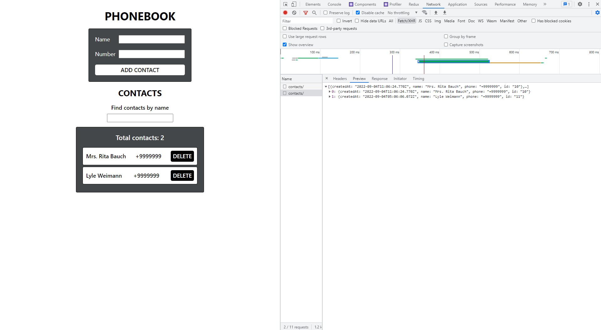

# React Phonebook with Async Redux Toolkit

## The code of this application was refactored: [phonebook](https://github.com/GnatykOleg/react-phonebook-start-with-redux-toolkit-create-reducer) using Redux Toolkit( createAsyncThunk ).

#### Removed code responsible for storing and reading contacts from local storage, and the added interaction with the backend for storing contacts.

#### Created my backend for development using the mockapi.io UI service. Created a contacts resource to receive the /contacts endpoint.

#### Added loading indicator and error handling to Redux state. To do this, the form of the state has been changed.

```
{
  contacts: {
    items: [],
    isLoading: false,
    error: null
  },
  filter: ""
}
```

#### The following operations have been announced:

```
fetchContacts - getting an array of contacts (GET method) by request. The base action type is "contacts/fetchAll".
```

```
addContact - adding a contact (POST method). The base action type is "contacts/addContact".
```

```
deleteContact - contact deletion (DELETE method). The base action type is "contacts/deleteContact".
```


